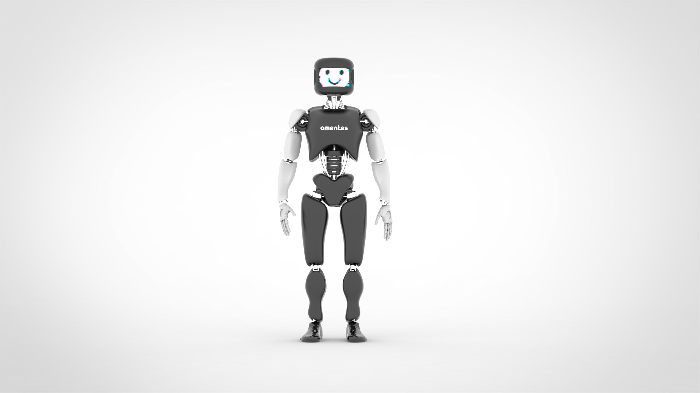
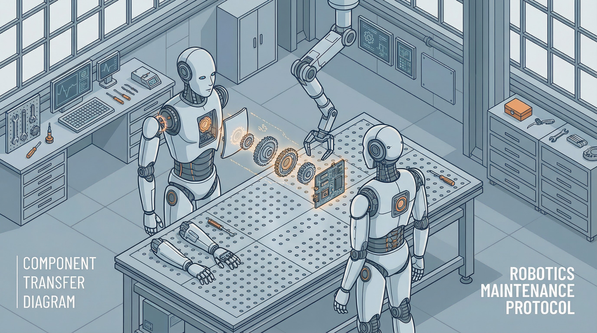

# ROBOTO_ORIGIN — полностью опенсорсный DIY-гуманоидный робот

[](https://www.gnu.org/licenses/gpl-3.0) [](https://docs.ros.org/en/humble/index.html) [](https://docs.omniverse.nvidia.com/isaacsim/latest/overview.html) [](https://isaac-sim.github.io/IsaacLab) [](https://docs.python.org/3/whatsnew/3.10.html) [](https://en.cppreference.com/w/C++17) [](https://ubuntu.com/)

---



## О проекте

Это **русскоязычный форк** проекта [Roboparty/roboto_origin](https://github.com/Roboparty/roboto_origin) — полностью опенсорсного DIY-гуманоидного робота.

**RoboParty** — китайская команда, основанная 21 февраля 2025 года. За четыре месяца они создали прототип **ROBOTO_ORIGIN** и открыли весь R&D-процесс: конструкции, электронику, обучение и развёртывание.

> Робота можно полностью собрать, закупив компоненты на Taobao и изготовив детали через Цзяличуан. С открытым кодом для обучения и развёртывания вы легко добьётесь ходьбы и бега.

---

## Документация

| Раздел | Описание |
|--------|----------|
| **[docs/](docs/)** | Полная документация проекта |
| **[Обзор проекта](docs/01_обзор_проекта/)** | Концепция, дорожная карта, рынок, поставщики |
| **[roboto_origin](docs/02_roboto_origin/)** | Архитектура, модули, сборка |
| **[OpenClaw](docs/03_openclaw/)** | AI-агенты для управления роботом |
| **[Презентация](docs/04_презентация_москва/)** | Материалы для госзаявки |

---

## Участие в проекте

**Важно:** Репозиторий `roboto_origin` — агрегатор снимков. Все issues и pull requests направляйте в конкретные sub-репозитории.

| Sub-репозиторий | Темы для контрибьюта |
|-----------------|----------------------|
| **[Atom01_hardware](https://github.com/Roboparty/Atom01_hardware)** | Механика, CAD, PCB, BOM |
| **[atom01_deploy](https://github.com/Roboparty/atom01_deploy)** | ROS2-драйверы, middleware, IMU/моторы |
| **[atom01_train](https://github.com/Roboparty/atom01_train)** | RL-алгоритмы, Isaac Lab, Sim2Sim |
| **[atom01_description](https://github.com/Roboparty/atom01_description)** | URDF, кинематика, динамика, меши |

**Подробнее:** [CONTRIBUTING.md](CONTRIBUTING.md)

**Спецификация компонентов:** [assets/BOM.md](./assets/BOM.md) (русский) | [assets/BOM_EN.md](./assets/BOM_EN.md) (английский)

---

<table>
  <tr>
    <td></td>
    <td></td>
  </tr>
</table>



---

## Модули

| Модуль | Описание | Репозиторий |
|--------|----------|-------------|
| **Atom01_hardware** | Аппаратная часть: конструкция, CAD, PCB | [GitHub](https://github.com/Roboparty/Atom01_hardware) |
| **atom01_deploy** | ROS2-фреймворк развёртывания: драйверы, IMU, моторы | [GitHub](https://github.com/Roboparty/atom01_deploy) |
| **atom01_train** | Обучение в IsaacLab: RL, Sim2Sim в MuJoCo | [GitHub](https://github.com/Roboparty/atom01_train) |
| **atom01_description** | URDF-модели: кинематика, динамика, меши | [GitHub](https://github.com/Roboparty/atom01_description) |

---

## Быстрый старт

```bash
# Клонировать репозиторий
git clone https://github.com/Roboparty/roboto_origin.git
cd roboto_origin

# Обновить
git pull
```

Перейдите в `modules/...` и следуйте README в каждом модуле.

---

## Кодекс поведения

Проект руководствуется [Кодексом поведения](CODE_OF_CONDUCT.md) для создания гостеприимного сообщества.

---

## Отказ от ответственности

### Лицензия и ограничения

Программное обеспечение предоставляется «как есть», без гарантий любого рода.

**Ответственность за оборудование:** Команды, генерируемые софтом, выполняются на физическом оборудовании. Последствия действий робота — ответственность оператора. Софт — лишь «вспомогательный инструмент», управление полностью на пользователе.

### Соглашение о вторичной разработке

За любое использование, модификацию, улучшение, вторичную разработку, эксплуатацию или распространение опенсорсных компонентов ответственность несёт пользователь. **RoboParty не несёт никакой ответственности.**

Используя, модифицируя или распространяя это ПО, вы соглашаетесь нести все связанные риски:
- Травмы или материальный ущерб от работы робота
- Повреждение оборудования из-за неправильной конфигурации
- Аварии из-за недостаточного тестирования безопасности

---

**Проект распространяется под лицензией GNU General Public License Version 3 (GPLv3). См. [LICENSE](LICENSE).**

---

## Благодарности

Этот проект основан на открытых материалах [RoboParty](https://github.com/Roboparty/roboto_origin) — китайского сообщества разработчиков DIY-робототехники.

Выражаем искреннюю благодарность нашим китайским друзьям за:
- Полностью открытую аппаратную платформу Atom01
- Исходный код обучения и развёртывания
- CAD-модели, URDF-описания и документацию
- Вдохновение для развития робототехники в России

<a href="https://github.com/Roboparty/roboto_origin/graphs/contributors">
  
</a>

---

**Русскоязычный форк поддерживается:** [ArtemAmentes](https://github.com/ArtemAmentes)
