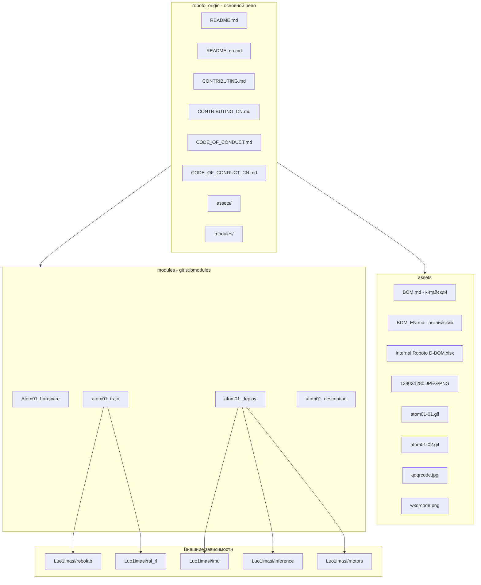
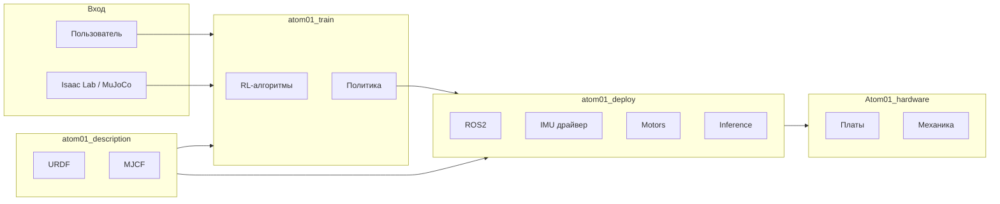

# Архитектура и структура репозитория Roboparty/roboto_origin

Полная схема репозитория [https://github.com/Roboparty/roboto_origin](https://github.com/Roboparty/roboto_origin) для создания 100% русской версии.

---

## 1. Общая архитектура



---

## 2. Дерево файлов (полная структура)

```
roboto_origin/                              # ~760 MB, 287 коммитов
│
├── .gitattributes                          # LFS, атрибуты
├── .gitignore                              # Исключения
├── README.md                               # EN — основной
├── README_cn.md                            # 中文 — КИТАЙСКИЙ, заменить на README_RU.md
├── CONTRIBUTING.md                         # EN — перевести
├── CONTRIBUTING_CN.md                      # 中文 — заменить на CONTRIBUTING_RU.md
├── CODE_OF_CONDUCT.md                     # EN — перевести
├── CODE_OF_CONDUCT_CN.md                   # 中文 — заменить на CODE_OF_CONDUCT_RU.md
│
├── assets/
│   ├── 1280X1280.JPEG                     # Фото робота
│   ├── 1280X1280.PNG                      # Схема
│   ├── atom01-01.gif                      # Демо 1
│   ├── atom01-02.gif                      # Демо 2
│   ├── BOM.md                             # КИТАЙСКИЙ BOM → BOM_RU.md
│   ├── BOM_EN.md                          # Англ. BOM → перевести в BOM_RU.md
│   ├── Internal Roboto D-BOM.xlsx         # Excel BOM (китайские колонки?)
│   ├── qqqrcode.jpg                       # QR QQ (китайский мессенджер)
│   └── wxqrcode.png                       # QR WeChat
│
└── modules/                                # Submodules → отдельные репо
    ├── Atom01_hardware/                    # https://github.com/Roboparty/Atom01_hardware
    ├── atom01_deploy/                      # https://github.com/Roboparty/atom01_deploy
    ├── atom01_train/                       # https://github.com/Roboparty/atom01_train
    └── atom01_description/                  # https://github.com/Roboparty/atom01_description
```

---

## 3. Детальная структура sub-репозиториев

### 3.1. Atom01_hardware

```
Atom01_hardware/
├── README.md                               # EN → README_RU.md
├── README_cn.md                            # 中文 — заменить
├── atom_id.png                             # Иллюстрация
├── atom01_mechnaic/                        # Механика, CAD (китайские имена?)
│   └── ...
└── atom01_pcb/                             # Печатные платы
    ├── Roboto_Power/                       # Схема питания
    └── Roboto_Usb2Can/                     # USB-CAN преобразователь
```

### 3.2. atom01_deploy (ROS2, драйверы)

```
atom01_deploy/
├── README.md                               # EN, 10 KB → README_RU.md
├── README_CN.md                            # 中文, 9 KB
├── .gitmodules                             # Submodules: imu, inference, motors
├── assets/
├── scripts/                                # Скрипты (возможно китайские комментарии)
├── src/
│   ├── imu/                                # Submodule: Luo1imasi/imu
│   ├── inference/                          # Submodule: Luo1imasi/inference
│   └── motors/                             # Submodule: Luo1imasi/motors
└── tools/
```

### 3.3. atom01_train (RL, Isaac Lab)

```
atom01_train/
├── README.md                               # EN → README_RU.md
├── README_CN.md                            # 中文
├── .gitmodules                             # robolab, rsl_rl
├── robolab/                                # Submodule: Luo1imasi/robolab (Isaac Lab)
└── rsl_rl/                                 # Submodule: Luo1imasi/rsl_rl
```

### 3.4. atom01_description (URDF, MuJoCo)

```
atom01_description/
├── README.md                               # Краткий
├── atom01_urdf.png
├── meshes/                                 # 3D-меши
├── mjcf/                                   # MuJoCo-формат
├── terrain_assets/                         # Ассеты местности
└── urdf/                                   # URDF-модели
```

---

## 4. Карта контента для перевода

| Расположение | Файлы с китайским/англ. | Действие |
|--------------|-------------------------|----------|
| **roboto_origin (корень)** | README_cn, CONTRIBUTING_CN, CODE_OF_CONDUCT_CN | Заменить на *_RU.md |
| **roboto_origin** | README, CONTRIBUTING, CODE_OF_CONDUCT | Добавить *_RU.md (перевод) |
| **assets/** | BOM.md (кит.), BOM_EN.md | Создать BOM_RU.md |
| **assets/** | Internal Roboto D-BOM.xlsx | Перевести заголовки колонок |
| **Atom01_hardware** | README, README_cn | README_RU.md |
| **atom01_deploy** | README, README_CN | README_RU.md |
| **atom01_train** | README, README_CN | README_RU.md |
| **atom01_description** | README | README_RU.md |
| **Код (Python, C++)** | docstrings, комментарии | Перевод в docstrings/комментариях |
| **Luo1imasi/* (submodules)** | imu, inference, motors, robolab, rsl_rl | Форк + перевод или оставить EN |

---

## 5. Внешние зависимости (Luo1imasi)

Модули atom01_deploy и atom01_train используют submodules из аккаунта **Luo1imasi**:

| Submodule | Репозиторий | Язык кода |
|-----------|-------------|-----------|
| imu | github.com/Luo1imasi/imu | Вероятно китайский |
| inference | github.com/Luo1imasi/inference | Вероятно китайский |
| motors | github.com/Luo1imasi/motors | Вероятно китайский |
| robolab | github.com/Luo1imasi/robolab | Isaac Lab |
| rsl_rl | github.com/Luo1imasi/rsl_rl | RSL-RL |

**Варианты для полной русификации:**
1. **Форк** Luo1imasi/* под свой аккаунт, перевод комментариев
2. **Обёртка** — оставить submodules как есть, перевести только README и docs в основном проекте
3. **Копия** — скопировать код в свой репо (с соблюдением лицензий), перевести

---

## 6. Поток данных и взаимодействие модулей



---

## 7. Объём работ для 100% русской версии

| Категория | Количество | Оценка труда |
|-----------|------------|--------------|
| MD-файлы (документация) | ~15 файлов | 2–3 дня |
| BOM (таблицы) | BOM.md, BOM_EN.md, xlsx | 1 день |
| Код (docstrings) | atom01_deploy, atom01_train | 3–5 дней |
| Код (комментарии) | Python, C++, YAML | 2–4 дня |
| Submodules Luo1imasi | 5 репо | 5–10 дней (если полный форк) |
| Имена файлов/папок | atom01_mechnaic (опечатка?) | Не менять |
| Know-How (roboparty.com) | Внешний сайт | Отдельный проект |

**Итого:** 2–4 недели (без Luo1imasi), 4–8 недель (с полным переводом submodules).

---

## 8. Стратегия «100% копия на русском»

### Вариант A: Монолитный форк

1. Клонировать roboto_origin с submodules
2. Создать свои форки Atom01_hardware, atom01_deploy, atom01_train, atom01_description
3. В каждом форке: добавить README_RU.md, перевести весь текст
4. Заменить submodule URLs на свои форки
5. В коде: перевести docstrings и комментарии (имена переменных — EN)

### Вариант B: Документация + обёртка

1. Один репозиторий с переведённой документацией (README_RU, CONTRIBUTING_RU, BOM_RU)
2. Submodules остаются на Roboparty/Luo1imasi
3. Добавить docs/ru/ с полными переводами
4. Код не трогать

### Вариант C: Полная копия (без submodules)

1. git clone --recursive
2. Удалить .git из submodules, скопировать всё в один репо
3. Перевести весь контент
4. Потеря связи с upstream (обновления вручную)

---

## 9. Список URL для скачивания

### Основной репо
- Archive: `https://github.com/Roboparty/roboto_origin/archive/refs/heads/main.zip`
- Или: `git clone --recurse-submodules https://github.com/Roboparty/roboto_origin.git`

### Submodules
- https://github.com/Roboparty/Atom01_hardware
- https://github.com/Roboparty/atom01_deploy
- https://github.com/Roboparty/atom01_train
- https://github.com/Roboparty/atom01_description

### Внешние (Luo1imasi)
- https://github.com/Luo1imasi/imu
- https://github.com/Luo1imasi/inference
- https://github.com/Luo1imasi/motors
- https://github.com/Luo1imasi/robolab
- https://github.com/Luo1imasi/rsl_rl

### Know-How документация
- https://roboparty.com/roboto_origin/doc

---

## 10. Рекомендуемый порядок перевода

1. **roboto_origin (корень):** README_RU, CONTRIBUTING_RU, CODE_OF_CONDUCT_RU  
2. **assets:** BOM_RU.md  
3. **Atom01_hardware:** README_RU  
4. **atom01_deploy:** README_RU  
5. **atom01_train:** README_RU  
6. **atom01_description:** README_RU  
7. **Код:** docstrings в atom01_deploy, atom01_train  
8. **Luo1imasi:** по необходимости (форк или оставить)  
9. **Know-How:** отдельный документ docs/know-how_RU/
