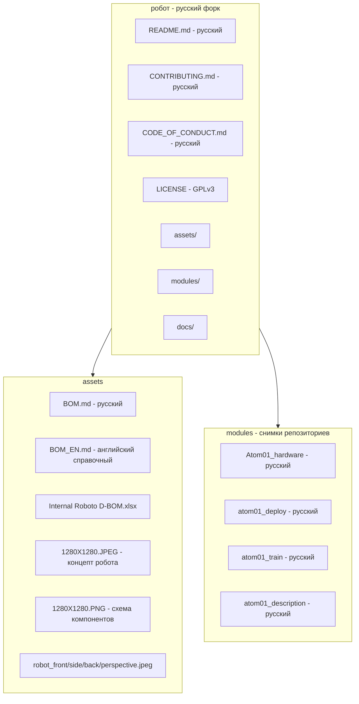
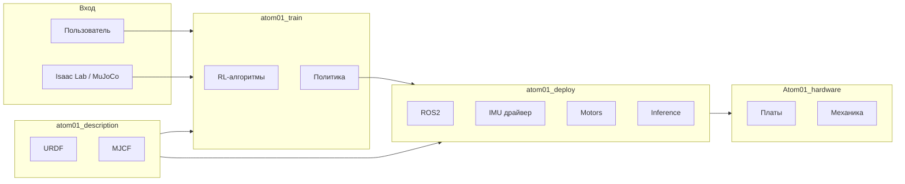

# Архитектура русского репозитория робот

Полная схема русифицированного репозитория [ArtemAmentes/робот](https://github.com/ArtemAmentes/roboto_origin) — форка [Roboparty/робот](https://github.com/Roboparty/roboto_origin).

---

## 1. Общая архитектура



---

## 2. Дерево файлов (текущая структура)

```
робот/
│
├── .gitattributes
├── .gitignore
├── LICENSE                               # GPLv3
├── README.md                             # Русский
├── CONTRIBUTING.md                       # Русский
├── CODE_OF_CONDUCT.md                    # Русский
│
├── assets/
│   ├── 1280X1280.JPEG                   # Концепт робота amentes
│   ├── 1280X1280.PNG                    # Схема компонентов
│   ├── robot_front.jpeg                 # Вид спереди
│   ├── robot_side.jpeg                  # Вид сбоку
│   ├── robot_back.jpeg                  # Вид сзади
│   ├── robot_perspective.jpeg           # Перспектива
│   ├── BOM.md                           # Русский BOM
│   ├── BOM_EN.md                        # Английский (справочный)
│   └── Internal Roboto D-BOM.xlsx       # Excel BOM
│
├── docs/
│   ├── 01_обзор_проекта/
│   └── 02_робот/
│
├── presentation/                         # Концепты робота amentes
│
└── modules/
    ├── Atom01_hardware/                  # README на русском
    ├── atom01_deploy/                    # README + скрипты на русском
    ├── atom01_train/                     # README + комментарии на русском
    └── atom01_description/               # README на русском
```

---

## 3. Статус русификации

| Элемент | Статус |
|---------|--------|
| README.md | ✅ Русский |
| CONTRIBUTING.md | ✅ Русский |
| CODE_OF_CONDUCT.md | ✅ Русский |
| LICENSE | ✅ GPLv3 |
| assets/BOM.md | ✅ Русский |
| modules/*/README.md | ✅ Русский |
| Python-комментарии | ✅ Русский |
| Китайские файлы (*_CN.md) | ❌ Удалены |
| QR-коды (WeChat, QQ) | ❌ Удалены |
| GIF-демо | ❌ Удалены |
| Картинки | ✅ Заменены на концепты amentes |

---

## 4. Структура sub-модулей

### 4.1. Atom01_hardware

```
Atom01_hardware/
├── README.md                             # Русский
├── atom_id.png
├── atom01_mechnaic/                      # Механика, CAD
│   └── README.md                         # Русский
└── atom01_pcb/
    ├── Roboto_Power/README.md            # Русский
    └── Roboto_Usb2Can/README.md          # Русский
```

### 4.2. atom01_deploy (ROS2, драйверы)

```
atom01_deploy/
├── README.md                             # Русский
├── scripts/
│   ├── motors_py_example.py              # Комментарии на русском
│   ├── imu_py_example.py                 # Комментарии на русском
│   ├── set_zero.py                       # Комментарии на русском
│   └── motion_player.py                  # Комментарии на русском
└── src/
    ├── imu/README.md                     # Русский
    ├── inference/
    └── motors/
```

### 4.3. atom01_train (RL, Isaac Lab)

```
atom01_train/
├── README.md                             # Русский
├── robolab/
│   └── scripts/
│       ├── rsl_rl/*.py                   # Комментарии на русском
│       ├── mujoco/*.py                   # Комментарии на русском
│       └── tools/*.py                    # Комментарии на русском
└── rsl_rl/
    └── rsl_rl/networks/attn_encoder.py   # Комментарии на русском
```

### 4.4. atom01_description (URDF, MuJoCo)

```
atom01_description/
├── README.md                             # Русский
├── atom01_urdf.png
├── meshes/
├── mjcf/
├── terrain_assets/
└── urdf/
```

---

## 5. Поток данных и взаимодействие модулей



---

## 6. Связанные разделы

| Документ | Описание |
|----------|----------|
| [README модулей](README_модулей_RU.md) | Описание всех модулей Atom01 |
| [Сборка робота](сборка_робота.md) | Quick Start, BOM, альтернативы для РФ |
| [Структура репозитория](структура_открытого_репозитория.md) | Целевая структура |
