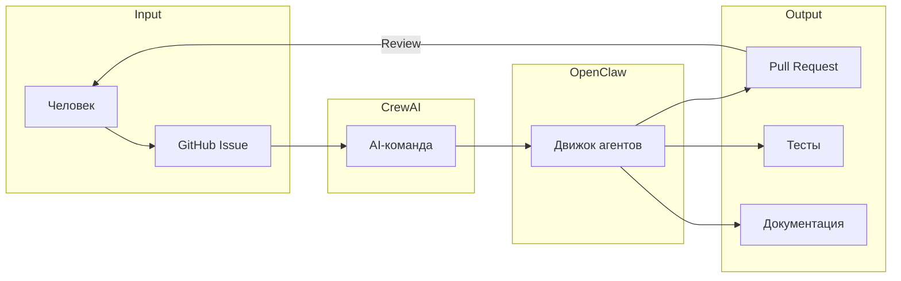

# CrewAI: AI-команда разработчиков опенсорсного ПО для робота

Документ описывает использование [CrewAI](https://crewai.com/) для создания полноценной команды AI-агентов, которые совместно разрабатывают опенсорсное ПО для робота. В качестве главного движка агентов используется [OpenClaw](https://openclaw.ai/).

---

## 1. Концепция

**Идея:** Вместо одного AI-ассистента создать целую команду специализированных агентов, которые работают вместе как настоящая команда разработчиков.

```
┌─────────────────────────────────────────────────────────────────┐
│                     CrewAI Orchestrator                         │
│            (координация, распределение задач)                   │
└───────────────────────────┬─────────────────────────────────────┘
                            │
        ┌───────────────────┼───────────────────┐
        ▼                   ▼                   ▼
┌──────────────┐   ┌──────────────┐   ┌──────────────────┐
│  Архитектор  │   │  Разработчик │   │  Тестировщик     │
│  (design)    │   │  (coding)    │   │  (QA)            │
└──────┬───────┘   └──────┬───────┘   └────────┬─────────┘
       │                  │                    │
       └──────────────────┼────────────────────┘
                          ▼
              ┌─────────────────────┐
              │     OpenClaw        │
              │  (движок агентов)   │
              └─────────────────────┘
```

---

## 2. Состав AI-команды

| Роль | LLM | Специализация | Инструменты |
|------|-----|---------------|-------------|
| **Архитектор** | Claude | Проектирование архитектуры, API, интерфейсы | UML, диаграммы, спецификации |
| **Backend-разработчик** | Claude | ROS2, драйверы, middleware | Python, C++, ROS2 |
| **Code Reviewer** | Claude | Код-ревью, стандарты качества | Линтеры, статический анализ |
| **DevOps** | Claude | CI/CD, деплой, инфраструктура | Docker, GitHub Actions |
| **ML-инженер** | Gemini | RL-алгоритмы, обучение, Sim2Real | PyTorch, IsaacLab, MuJoCo |
| **Тестировщик** | Gemini | Тесты, симуляция, валидация | pytest, видео-анализ |
| **Документатор** | Gemini | README, API-доки, туториалы | Markdown, Sphinx |
| **Frontend-разработчик** | Gemini | UI, визуализация, дашборды | React, Grafana, RViz |

---

## 3. Интеграция CrewAI + OpenClaw

### Почему OpenClaw как движок?

- **Full System Access** — агенты имеют доступ к файлам, shell, git
- **Self-hosted** — данные под контролем, работа в закрытом контуре
- **Persistent Memory** — контекст проекта сохраняется между сессиями
- **Skills & Plugins** — каждый агент может иметь специализированные навыки

### Две базовые LLM: Claude AI + Gemini

Архитектурно используются два порождающих ИИ:

| LLM | Специализация | Агенты |
|-----|---------------|--------|
| **Claude AI** (Anthropic) | Глубокий анализ, архитектура, код, ревью | Архитектор, Backend, Code Reviewer |
| **Gemini** (Google) | Мультимодальность, большой контекст, скорость | ML-инженер, Документатор, Тестировщик |

**Преимущества двойной архитектуры:**
- **Разнообразие подходов** — разные модели видят проблему по-разному
- **Резервирование** — если одна недоступна, работает вторая
- **Оптимизация затрат** — Gemini дешевле для объёмных задач (документация, анализ логов)
- **Мультимодальность** — Gemini работает с изображениями (CAD, схемы, видео с робота)

### Архитектура

```
┌─────────────────────────────────────────────────────────────────┐
│                     CrewAI Orchestrator                         │
└───────────────────────────┬─────────────────────────────────────┘
                            │
        ┌───────────────────┴───────────────────┐
        ▼                                       ▼
┌──────────────────┐                   ┌──────────────────┐
│   Claude AI      │                   │    Gemini        │
│  (Anthropic)     │                   │   (Google)       │
├──────────────────┤                   ├──────────────────┤
│ • Архитектор     │                   │ • ML-инженер     │
│ • Backend        │                   │ • Документатор   │
│ • Code Reviewer  │                   │ • Тестировщик    │
│ • DevOps         │                   │ • Frontend       │
└────────┬─────────┘                   └────────┬─────────┘
         │                                      │
         └──────────────────┬───────────────────┘
                            ▼
              ┌─────────────────────┐
              │     OpenClaw        │
              │  (движок агентов)   │
              └─────────────────────┘
```

```python
from crewai import Agent, Task, Crew
from langchain_anthropic import ChatAnthropic
from langchain_google_genai import ChatGoogleGenerativeAI

# Инициализация двух LLM
claude = ChatAnthropic(model="claude-sonnet-4-20250514")
gemini = ChatGoogleGenerativeAI(model="gemini-2.0-pro")

# Агенты на Claude AI (глубокий анализ, архитектура, код)
architect = Agent(
    role="Архитектор ПО",
    goal="Проектировать масштабируемую архитектуру для робота",
    backstory="Опытный системный архитектор с 15-летним стажем в робототехнике",
    llm=claude,  # Claude для архитектурных решений
    tools=[uml_tool, spec_writer]
)

developer = Agent(
    role="Backend-разработчик",
    goal="Писать чистый, эффективный код для ROS2-модулей",
    backstory="Senior Python/C++ разработчик, контрибьютор ROS2",
    llm=claude,  # Claude для качественного кода
    tools=[code_writer, git_tool, ros2_tool]
)

code_reviewer = Agent(
    role="Code Reviewer",
    goal="Обеспечивать качество и безопасность кода",
    backstory="Staff-инженер с опытом в критичных системах",
    llm=claude,  # Claude для глубокого анализа
    tools=[linter_tool, security_scanner]
)

# Агенты на Gemini (мультимодальность, большой контекст)
ml_engineer = Agent(
    role="ML-инженер",
    goal="Обучать RL-политики для управления роботом",
    backstory="Исследователь RL с опытом в IsaacLab и MuJoCo",
    llm=gemini,  # Gemini для анализа логов обучения, графиков
    tools=[training_tool, simulation_tool]
)

tester = Agent(
    role="Тестировщик",
    goal="Обеспечивать качество кода через автотесты",
    backstory="QA-инженер с опытом в робототехнике и симуляции",
    llm=gemini,  # Gemini для анализа видео с симуляции
    tools=[pytest_tool, simulation_tool, video_analyzer]
)

documentator = Agent(
    role="Документатор",
    goal="Создавать понятную документацию и туториалы",
    backstory="Технический писатель с опытом в робототехнике",
    llm=gemini,  # Gemini для обработки больших объёмов текста
    tools=[markdown_tool, sphinx_tool]
)
```

---

## 4. Workflow разработки

### 4.1. Получение задачи

```
Человек (через Telegram/Discord):
"Добавить поддержку нового типа моторов DM-J4310"
```

### 4.2. Распределение CrewAI

```python
# Задачи для команды
task_design = Task(
    description="Спроектировать интерфейс драйвера для DM-J4310",
    agent=architect,
    expected_output="Спецификация API, UML-диаграмма"
)

task_implement = Task(
    description="Реализовать драйвер на основе спецификации",
    agent=developer,
    context=[task_design],  # Зависит от архитектора
    expected_output="Python-модуль с драйвером"
)

task_test = Task(
    description="Написать тесты для нового драйвера",
    agent=tester,
    context=[task_implement],  # Зависит от разработчика
    expected_output="Unit-тесты, интеграционные тесты"
)

# Запуск команды
crew = Crew(
    agents=[architect, developer, tester],
    tasks=[task_design, task_implement, task_test],
    verbose=True
)

result = crew.kickoff()
```

### 4.3. Результат

```
Архитектор → Спецификация API (30 мин)
    ↓
Разработчик → Код драйвера (2 часа)
    ↓
Тестировщик → Тесты + отчёт (1 час)
    ↓
Автоматический PR в репозиторий
```

---

## 5. Специализированные экипажи (Crews)

### Crew 1: Разработка нового функционала

| Агент | Задача |
|-------|--------|
| Архитектор | Дизайн |
| Разработчик | Реализация |
| Тестировщик | Тесты |
| Документатор | README |

### Crew 2: Исправление багов

| Агент | Задача |
|-------|--------|
| Тестировщик | Воспроизведение бага |
| Разработчик | Исправление |
| Code Reviewer | Проверка фикса |

### Crew 3: Обучение RL-моделей

| Агент | Задача |
|-------|--------|
| ML-инженер | Настройка обучения |
| DevOps | Запуск на GPU-кластере |
| Тестировщик | Валидация в симуляции |

### Crew 4: Релиз

| Агент | Задача |
|-------|--------|
| Code Reviewer | Финальный ревью |
| DevOps | CI/CD, сборка |
| Документатор | Changelog, release notes |

---

## 6. Преимущества AI-команды

| Аспект | Человеческая команда | CrewAI + OpenClaw |
|--------|----------------------|-------------------|
| **Доступность** | Рабочие часы | 24/7 |
| **Масштабирование** | Найм, онбординг | Мгновенное |
| **Стоимость** | Зарплаты, офис | API-вызовы |
| **Консистентность** | Зависит от людей | Стабильная |
| **Скорость** | Часы/дни | Минуты/часы |
| **Документация** | Часто забывают | Автоматическая |

---

## 7. Интеграция с Git-репозиторием

AI-команда напрямую связана с репозиторием и модернизирует код автономно.

### 7.1. Архитектура Git-интеграции

```
┌─────────────────────────────────────────────────────────────────────────┐
│                        GitHub / GitLab                                   │
│  ┌─────────────┐  ┌─────────────┐  ┌─────────────┐  ┌─────────────┐     │
│  │   Issues    │  │    PRs      │  │  Branches   │  │   Actions   │     │
│  └──────┬──────┘  └──────┬──────┘  └──────┬──────┘  └──────┬──────┘     │
└─────────┼────────────────┼────────────────┼────────────────┼────────────┘
          │                │                │                │
          ▼                ▼                ▼                ▼
┌─────────────────────────────────────────────────────────────────────────┐
│                         Git Agent (DevOps)                               │
│  • Мониторинг Issues и PR                                                │
│  • Создание веток                                                        │
│  • Коммиты и пуши                                                        │
│  • Запуск CI/CD                                                          │
└───────────────────────────────┬─────────────────────────────────────────┘
                                │
                                ▼
┌─────────────────────────────────────────────────────────────────────────┐
│                        CrewAI Orchestrator                               │
│  (распределяет задачи между агентами на основе Issue/PR)                 │
└───────────────────────────────┬─────────────────────────────────────────┘
                                │
        ┌───────────────────────┼───────────────────────┐
        ▼                       ▼                       ▼
┌──────────────┐       ┌──────────────┐       ┌──────────────┐
│  Архитектор  │       │  Разработчик │       │  Тестировщик │
└──────────────┘       └──────────────┘       └──────────────┘
```

### 7.2. Автоматический Workflow

```python
from crewai import Agent, Task, Crew
from github import Github

# Git-агент для работы с репозиторием
git_agent = Agent(
    role="DevOps / Git Manager",
    goal="Управлять репозиторием, создавать PR, следить за CI",
    llm=claude,
    tools=[
        GitHubTool(repo="ArtemAmentes/roboto_origin"),
        BranchManager(),
        CIMonitor()
    ]
)

# Workflow: Issue → Branch → Code → PR → Merge
def process_github_issue(issue_number: int):
    # 1. Получить Issue
    issue = github.get_issue(issue_number)
    
    # 2. Создать ветку
    branch_name = f"feature/issue-{issue_number}"
    git_agent.create_branch(branch_name)
    
    # 3. Распределить задачи команде
    crew = Crew(
        agents=[architect, developer, tester, git_agent],
        tasks=[
            Task(description=f"Проанализировать: {issue.title}", agent=architect),
            Task(description="Реализовать решение", agent=developer),
            Task(description="Написать тесты", agent=tester),
            Task(description="Создать PR", agent=git_agent)
        ]
    )
    
    result = crew.kickoff()
    
    # 4. Создать Pull Request
    pr = git_agent.create_pull_request(
        title=f"Fix #{issue_number}: {issue.title}",
        body=result.summary,
        branch=branch_name
    )
    
    return pr
```

### 7.3. Триггеры автоматизации

| Триггер | Действие | Агенты |
|---------|----------|--------|
| Новый Issue с меткой `bug` | Автоматический анализ и фикс | Тестировщик → Разработчик |
| Новый Issue с меткой `feature` | Проектирование и реализация | Архитектор → Разработчик |
| PR создан | Автоматический код-ревью | Code Reviewer |
| PR одобрен | Merge и деплой | DevOps |
| CI упал | Анализ ошибки и фикс | Тестировщик → Разработчик |
| Новый релиз | Генерация changelog | Документатор |

### 7.4. Защита репозитория

```yaml
# .github/workflows/ai-guard.yml
name: AI Contribution Guard

on:
  pull_request:
    branches: [main]

jobs:
  validate:
    runs-on: ubuntu-latest
    steps:
      - name: Check AI commits
        run: |
          # Проверка что AI-коммиты прошли ревью
          if [[ "${{ github.event.pull_request.user.login }}" == "ai-crew-bot" ]]; then
            # Требуется одобрение человека
            gh pr review ${{ github.event.number }} --request-changes \
              -b "Требуется одобрение человека для AI-изменений"
          fi
          
      - name: Security scan
        run: |
          # Сканирование на уязвимости
          bandit -r . -f json -o security-report.json
          
      - name: Test coverage check
        run: |
          # Проверка покрытия тестами
          pytest --cov=. --cov-fail-under=80
```



---

## 8. Camera-in-the-Loop: Визуальный движок автономной доработки ПО

**Ключевая инновация:** AI-система наблюдает за реальным роботом через камеру и автоматически переписывает софт, добиваясь визуального подтверждения корректности движений.

### 8.1. Концепция

```
┌─────────────────────────────────────────────────────────────────────────┐
│                     CAMERA-IN-THE-LOOP ENGINE                            │
│                                                                          │
│   ┌─────────┐      ┌─────────────┐      ┌─────────────┐                 │
│   │ Камера  │ ───► │  Gemini     │ ───► │  Анализ     │                 │
│   │ (видео) │      │  Vision     │      │  движений   │                 │
│   └─────────┘      └─────────────┘      └──────┬──────┘                 │
│                                                 │                        │
│                                                 ▼                        │
│   ┌─────────┐      ┌─────────────┐      ┌─────────────┐                 │
│   │ Робот   │ ◄─── │  Новый код  │ ◄─── │  Claude     │                 │
│   │ (железо)│      │  (patch)    │      │  (кодинг)   │                 │
│   └─────────┘      └─────────────┘      └─────────────┘                 │
│                                                                          │
│   Цикл: Наблюдение → Анализ → Генерация кода → Деплой → Наблюдение      │
└─────────────────────────────────────────────────────────────────────────┘
```

### 8.2. Архитектура движка

```python
from crewai import Agent, Task, Crew
from langchain_google_genai import ChatGoogleGenerativeAI
from langchain_anthropic import ChatAnthropic
import cv2

class CameraInTheLoopEngine:
    """
    Движок автономной доработки ПО на основе визуального наблюдения.
    """
    
    def __init__(self, robot_ip: str, camera_url: str, repo_path: str):
        self.robot = RobotController(robot_ip)
        self.camera = cv2.VideoCapture(camera_url)
        self.repo = GitRepo(repo_path)
        
        # Gemini для анализа видео (мультимодальность)
        self.vision_agent = Agent(
            role="Визуальный аналитик",
            goal="Анализировать движения робота и выявлять отклонения",
            llm=ChatGoogleGenerativeAI(model="gemini-2.0-pro"),
            tools=[VideoAnalyzer(), MotionTracker(), PoseEstimator()]
        )
        
        # Claude для генерации кода
        self.code_agent = Agent(
            role="Инженер управления",
            goal="Корректировать код управления для достижения целевого поведения",
            llm=ChatAnthropic(model="claude-sonnet-4-20250514"),
            tools=[CodeEditor(), ROS2Interface(), MotorController()]
        )
        
        # Агент безопасности
        self.safety_agent = Agent(
            role="Инженер безопасности",
            goal="Предотвращать опасные движения и повреждения",
            llm=ChatAnthropic(model="claude-sonnet-4-20250514"),
            tools=[SafetyLimits(), EmergencyStop()]
        )
    
    def run_optimization_loop(self, target_motion: str, max_iterations: int = 10):
        """
        Основной цикл оптимизации движений.
        
        Args:
            target_motion: Описание целевого движения ("плавный шаг вперёд")
            max_iterations: Максимум итераций оптимизации
        """
        
        for iteration in range(max_iterations):
            print(f"\n=== Итерация {iteration + 1} ===")
            
            # 1. Записать видео движения
            video_frames = self.capture_motion(duration=5.0)
            
            # 2. Проанализировать видео через Gemini
            analysis = self.vision_agent.analyze(
                video=video_frames,
                target=target_motion,
                prompt=f"""
                Проанализируй движение робота на видео.
                Целевое движение: {target_motion}
                
                Оцени:
                1. Плавность движения (0-100%)
                2. Соответствие целевому движению (0-100%)
                3. Стабильность (0-100%)
                4. Выявленные проблемы
                5. Рекомендации по корректировке
                """
            )
            
            # 3. Проверить достижение цели
            if analysis.score >= 95:
                print(f"✅ Цель достигнута! Итоговый скор: {analysis.score}%")
                self.commit_changes(f"Оптимизация движения: {target_motion}")
                return True
            
            # 4. Сгенерировать патч кода через Claude
            code_task = Task(
                description=f"""
                На основе анализа движения робота, исправь код управления.
                
                Текущий анализ:
                - Плавность: {analysis.smoothness}%
                - Соответствие: {analysis.accuracy}%
                - Проблемы: {analysis.issues}
                - Рекомендации: {analysis.recommendations}
                
                Файлы для правки:
                - modules/atom01_deploy/scripts/motion_controller.py
                - modules/atom01_deploy/config/motor_params.yaml
                """,
                agent=self.code_agent,
                expected_output="Git patch с исправлениями"
            )
            
            patch = code_task.execute()
            
            # 5. Проверка безопасности
            safety_check = self.safety_agent.validate(patch)
            if not safety_check.is_safe:
                print(f"⚠️ Небезопасный патч: {safety_check.reason}")
                continue
            
            # 6. Применить патч и протестировать
            self.repo.apply_patch(patch)
            self.robot.reload_controllers()
            
            print(f"📊 Итерация {iteration + 1}: скор {analysis.score}%")
        
        return False
    
    def capture_motion(self, duration: float) -> list:
        """Захват видео с камеры."""
        frames = []
        start = time.time()
        while time.time() - start < duration:
            ret, frame = self.camera.read()
            if ret:
                frames.append(frame)
        return frames
    
    def commit_changes(self, message: str):
        """Коммит успешных изменений."""
        self.repo.add_all()
        self.repo.commit(f"[AI] {message}")
        self.repo.push()
```

### 8.3. Workflow визуальной оптимизации

```
┌────────────────────────────────────────────────────────────────┐
│  1. ЗАДАНИЕ                                                     │
│     "Робот должен плавно поднять правую руку на 90°"           │
└─────────────────────────┬──────────────────────────────────────┘
                          │
                          ▼
┌────────────────────────────────────────────────────────────────┐
│  2. ИСПОЛНЕНИЕ                                                  │
│     Робот выполняет текущий код → Камера записывает видео      │
└─────────────────────────┬──────────────────────────────────────┘
                          │
                          ▼
┌────────────────────────────────────────────────────────────────┐
│  3. АНАЛИЗ (Gemini Vision)                                      │
│     • Рука поднялась на 75° (не 90°)                           │
│     • Движение дёрганое в начале                                │
│     • Рекомендация: увеличить P-коэффициент, добавить ramp-up  │
└─────────────────────────┬──────────────────────────────────────┘
                          │
                          ▼
┌────────────────────────────────────────────────────────────────┐
│  4. ГЕНЕРАЦИЯ ПАТЧА (Claude)                                    │
│     • motor_params.yaml: p_gain: 0.8 → 1.2                     │
│     • motion_controller.py: добавлен ramp_up(0.5s)             │
└─────────────────────────┬──────────────────────────────────────┘
                          │
                          ▼
┌────────────────────────────────────────────────────────────────┐
│  5. ПРОВЕРКА БЕЗОПАСНОСТИ                                       │
│     ✅ p_gain в допустимых пределах (0.1 - 2.0)                │
│     ✅ ramp_up не нарушает динамические ограничения            │
└─────────────────────────┬──────────────────────────────────────┘
                          │
                          ▼
┌────────────────────────────────────────────────────────────────┐
│  6. ПРИМЕНЕНИЕ И ПОВТОР                                         │
│     Патч применён → Повтор с шага 2                            │
│     Итерации: 1→75%, 2→85%, 3→92%, 4→97% ✅                    │
└────────────────────────────────────────────────────────────────┘
```

### 8.4. Компоненты движка

| Компонент | Технология | Функция |
|-----------|------------|---------|
| **Камера** | USB/IP камера, 30fps+ | Захват видео движений |
| **Pose Estimator** | MediaPipe / OpenPose | Скелетная модель робота |
| **Motion Analyzer** | Gemini 2.0 Pro Vision | Анализ качества движений |
| **Code Generator** | Claude Sonnet | Генерация патчей кода |
| **Safety Validator** | Claude + правила | Проверка безопасности |
| **Git Manager** | GitPython | Коммиты, версионирование |
| **Robot Interface** | ROS2 / CAN | Деплой на железо |

### 8.5. Пример использования

```python
# Запуск движка
engine = CameraInTheLoopEngine(
    robot_ip="192.168.1.100",
    camera_url="rtsp://192.168.1.50:554/stream",
    repo_path="/home/robot/roboto_origin"
)

# Оптимизация ходьбы
engine.run_optimization_loop(
    target_motion="Стабильная ходьба вперёд со скоростью 0.5 м/с",
    max_iterations=20
)

# Оптимизация жеста
engine.run_optimization_loop(
    target_motion="Плавное приветственное движение рукой",
    max_iterations=10
)

# Оптимизация баланса
engine.run_optimization_loop(
    target_motion="Устойчивое стояние при толчке в грудь",
    max_iterations=15
)
```

### 8.6. Безопасность Camera-in-the-Loop

| Уровень | Механизм | Описание |
|---------|----------|----------|
| **L1** | Hardware limits | Физические ограничения моторов |
| **L2** | Safety agent | AI-проверка патчей перед деплоем |
| **L3** | Gradual rollout | Изменения применяются постепенно (10%, 50%, 100%) |
| **L4** | Emergency stop | Кнопка аварийной остановки |
| **L5** | Human approval | Критические изменения требуют одобрения |

### 8.7. Преимущества подхода

- **Автономность** — система сама находит оптимальные параметры
- **Реальные условия** — оптимизация на железе, не в симуляции
- **Визуальное подтверждение** — объективная оценка качества движений
- **Итеративность** — постепенное улучшение до достижения цели
- **Версионирование** — каждое улучшение сохраняется в Git
- **Безопасность** — многоуровневая защита от повреждений

---

## 9. Безопасность и контроль общей системы

- **Human-in-the-loop** — критические изменения требуют одобрения человека
- **Sandboxed execution** — агенты работают в изолированной среде
- **Audit log** — все действия агентов логируются
- **Rollback** — возможность отката любых изменений
- **Self-hosted OpenClaw** — данные не покидают инфраструктуру

---

## 10. Roadmap интеграции

| Этап | Задачи |
|------|--------|
| **MVP** | Базовая интеграция CrewAI + OpenClaw, 3 агента (Claude + Gemini) |
| **v1.0** | Полная команда из 8 агентов, CI/CD интеграция с GitHub |
| **v2.0** | Автономная разработка по GitHub Issues |
| **v3.0** | Camera-in-the-Loop: визуальная оптимизация в симуляции |
| **v4.0** | Camera-in-the-Loop: оптимизация на реальном железе |
| **v5.0** | Полностью автономный цикл: Issue → Code → Test → Hardware → Commit |

---

## Связанные документы

| Документ | Описание |
|----------|----------|
| [Стратегия интеграции OpenClaw](стратегия_интеграции_openclaw.md) | OpenClaw как кодирующий агент |
| [ClawBody и адаптация](clawbody_и_адаптация.md) | Физическое воплощение агента |
